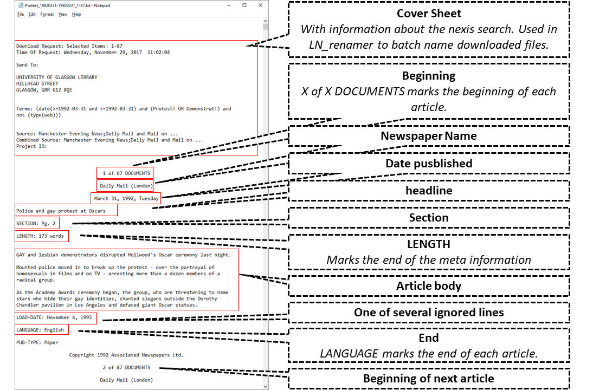
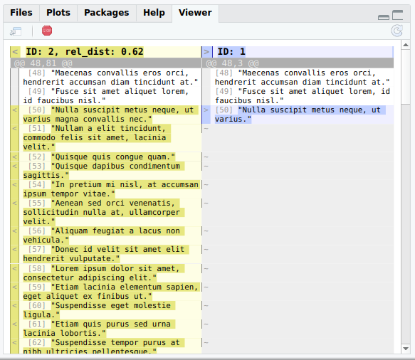

# LexisNexisTools

[](https://github.com/JBGruber/LexisNexisTools/actions/workflows/R-CMD-check.yaml)
[](https://cran.r-project.org/package=LexisNexisTools)
[](https://cran.r-project.org/package=LexisNexisTools)
[](https://app.codecov.io/gh/JBGruber/LexisNexisTools?branch=master)

## Motivation

My PhD supervisor once told me that everyone doing newspaper analysis starts by writing code to read in files from the 'LexisNexis' newspaper archive.
However, while I do recommend this exercise, not everyone has the time.
This package provides functions to read in TXT, RTF, DOC and PDF files downloaded from the old 'LexisNexis' or DOCX from the new Nexis Uni, Lexis Advance and similar services.
The package also comes with a few other features that should be useful while working with data from the popular newspaper archive.

**Did you experience any problems, have questions or an idea about a great new feature?** Then please don't hesitate to file an [**issue report**](https://github.com/JBGruber/LexisNexisTools/issues).

## Installation
Install via:


```r
install.packages("LexisNexisTools")
```

Or get the development version by installing directly from GitHub (if you do not have `remotes` yet install it via `install.packages("remotes")` first):


```r
remotes::install_github("JBGruber/LexisNexisTools")
```

## Demo
### Load Package


```r
library("LexisNexisTools")
```

If you do not yet have files from 'LexisNexis' but want to test the package, you can use `lnt_sample()` to copy a sample file with mock data into your current working directory:


```r
lnt_sample()
```

### Rename Files

'LexisNexis' does not give its files proper names.
The function `lnt_rename()` renames files to a standard format:
For TXT files this format is "searchTerm_startDate-endDate_documentRange.txt" (e.g., "Obama_20091201-20100511_1-500.txt") (for other file types the format is similar but depends on what information is available).
Note, that this will not work if your files lack a cover page with this information.
Currently, it seems, like 'LexisNexis' only delivers those cover pages when you first create a link to your search ("link to this search" on the results page), follow this link, and then download the TXT files from there (see here for a [visual explanation](https://github.com/JBGruber/LexisNexisTools/wiki/Downloading-Files-From-Nexis)).
If you do not want to rename files, you can skip to the next section.
The rest of the package's functionality stays untouched by whether you rename your files or not.
However, in a larger database, you will profit from a consistent naming scheme.

There are three ways in which you can rename the files:

 - Run lnt_rename() directly in your working directory without the x argument, which will prompt an option to scan for TXT files in your current working directory:


```r
report <- lnt_rename()
```

 - Provide a folder path (and set `recursive = TRUE` if you want to scan for files recursively):


```r
report <- lnt_rename(x = getwd(), report = TRUE)
```

 - Provide a character object with file names.
Use `list.files()` to search for files in a certain path.


```r
my_files <- list.files(pattern = ".txt", path = getwd(),
                       full.names = TRUE, recursive = TRUE, ignore.case = TRUE)
report <- lnt_rename(x = my_files, report = TRUE)

report
```


|name_orig  |name_new                              |status  |type |
|:----------|:-------------------------------------|:-------|:----|
|sample.TXT |SampleFile_20091201-20100511_1-10.txt |renamed |txt  |

Using `list.files()` instead of the built-in mechanism allows you to specify a file pattern.
This might be a preferred option if you have a folder in which only some of the TXT files contain newspaper articles from 'LexisNexis' but other files have the ending TXT as well.
If you are unsure what the TXT files in your chosen folder might contain, use the option `simulate = TRUE` (which is the default).
The argument `report = TRUE` indicates that the output of the function in `R` will be a data.frame containing a report on which files have been changed on your drive and how.

### Read in 'LexisNexis' Files to Get Meta, Articles and Paragraphs

The main function of this package is `lnt_read()`.
It converts the raw files into three different `data.frames` nested in a special S4 object of class `LNToutput`.
The three data.frames contain (1.) the metadata of the articles, (2.) the articles themselves, and (3.) the paragraphs.

There are several important keywords that are used to split up the raw articles into article text and metadata.
Those need to be provided in some form but can be left to 'auto' to use 'LexisNexis' defaults in several languages.
All keywords can be regular expressions and need to be in most cases:

- `start_keyword`: The English default is "\\d+ of \\d+ DOCUMENTS$" which stands for, for example, "1 of 112 DOCUMENTS". It is used to split up the text in the TXT files into individual articles. You will not have to change anything here, except you work with documents in languages other than the currently supported.
- `end_keyword`: This keyword is used to remove unnecessary information at the end of an article. Usually, this is "^LANGUAGE:". Where the keyword isn't found, the additional information ends up in the article text.
- `length_keyword`: This keyword, which is usually just "^LENGTH:" (or its equivalent in other languages) finds the information about the length of an article.
However, since this is always the last line of the metadata, it is used to separate metadata and article text.
There seems to be only one type of cases where this information is missing:
if the article consists only of a graphic (which 'LexisNexis' does not retrieve).
The final output from `lnt_read()` has a column named `Graphic`, which indicates if this keyword was missing.
The article text then contains all metadata as well.
In these cases, you should remove the whole article after inspecting it.
(Use `View(LNToutput@articles$Article[LNToutput@meta$Graphic])` to view these articles in a spreadsheet like viewer.)

<p align="center">
   
</p>

To use the function, you can again provide either file name(s), folder name(s) or nothing---to search the current working directory for relevant files---as `x` argument:


```r
LNToutput <- lnt_read(x = getwd())
```


    ## Creating LNToutput from 1 file...
    ##  ...files loaded [0.0016 secs]
    ##  ...articles split [0.0089 secs]
    ##  ...lengths extracted [0.0097 secs]
    ##  ...newspapers extracted [0.01 secs]
    ##  ...dates extracted [0.012 secs]
    ##  ...authors extracted [0.013 secs]
    ##  ...sections extracted [0.014 secs]
    ##  ...editions extracted [0.014 secs]
    ##  ...headlines extracted [0.016 secs]
    ##  ...dates converted [0.023 secs]
    ##  ...metadata extracted [0.026 secs]
    ##  ...article texts extracted [0.029 secs]
    ##  ...paragraphs extracted [0.041 secs]
    ##  ...superfluous whitespace removed from articles [0.044 secs]
    ##  ...superfluous whitespace removed from paragraphs [0.046 secs]
    ## Elapsed time: 0.047 secs

The returned object  of class `LNToutput` is intended to be an intermediate container.
As it stores articles and paragraphs in two separate data.frames, nested in an S4 object, the relevant text data is stored twice in almost the same format.
This has the advantage, that there is no need to use special characters, such as "\\n".
However, it makes the files rather big when you save them directly.

The object can, however, be easily converted to regular data.frames using `@` to select the data.frame you want:


```r
meta_df <- LNToutput@meta
articles_df <- LNToutput@articles
paragraphs_df <- LNToutput@paragraphs

# Print meta to get an idea of the data
head(meta_df, n = 3)

```

| ID|Source_File                           |Newspaper         |Date       |Length    |Section         |Author          |Edition             |Headline                   |Graphic |
|--:|:-------------------------------------|:-----------------|:----------|:---------|:---------------|:---------------|:-------------------|:--------------------------|:-------|
|  1|SampleFile_20091201-20100511_1-10.txt |Guardian.com      |2010-01-11 |355 words |NA              |Andrew Sparrow  |NA                  |Lorem ipsum dolor sit amet |FALSE   |
|  2|SampleFile_20091201-20100511_1-10.txt |Guardian          |2010-01-11 |927 words |NA              |Simon Tisdall   |NA                  |Lorem ipsum dolor sit amet |FALSE   |
|  3|SampleFile_20091201-20100511_1-10.txt |The Sun (England) |2010-01-11 |677 words |FEATURES; Pg. 6 |TREVOR Kavanagh |Edition 1; Scotland |Lorem ipsum dolor sit amet |FALSE   |

If you want to keep only one data.frame including metadata and text data you can easily do so:


```r
meta_articles_df <- lnt_convert(LNToutput, to = "data.frame")

# Or keep the paragraphs
meta_paragraphs_df <- lnt_convert(LNToutput, to = "data.frame", what = "Paragraphs")
```

Alternatively, you can convert LNToutput objects to formats common in other packages using the function `lnt_convert`:


```r
rDNA_docs <- lnt_convert(LNToutput, to = "rDNA")

quanteda_corpus <- lnt_convert(LNToutput, to = "quanteda")

tCorpus <- lnt_convert(LNToutput, to = "corpustools")

tidy <- lnt_convert(LNToutput, to = "tidytext")

Corpus <- lnt_convert(LNToutput, to = "tm")

dbloc <- lnt_convert(LNToutput, to = "SQLite")
```

See `?lnt_convert` for details and comment in [this issue](https://github.com/JBGruber/LexisNexisTools/issues/2) if you want a format added to the convert function.

### Identify Highly Similar Articles

In 'LexisNexis' itself, there is an option to group highly similar articles.
However, experience shows that this feature does not always  work perfectly.
One common problem when working with 'LexisNexis' data is thus that many articles appear to be delivered twice or more times.
While direct duplicates can be filtered out using, for example, `LNToutput <- LNToutput[!duplicated(LNToutput@articles$Article), ]` this does not work for articles with small differences.
Hence when one comma or white space is different between two articles, they are  treated as different.

The function `lnt_similarity()` combines the fast similarity measure from [quanteda](https://github.com/quanteda/quanteda) with the much slower but more accurate relative [Levenshtein distance](https://en.wikipedia.org/wiki/Levenshtein_distance) to compare all articles published on the same day.
Calculating the Levenshtein distance might be very slow though if you have many articles published each day in your data set.
If you think the less accurate similarity measure might be sufficient in your case, simply turn this feature off with `rel_dist = FALSE`.
The easiest way to use `lnt_similarity()` is to input an `LNToutput` object directly.
However, it is also possible to provide texts, dates and IDs separately:


```r
# Either provide a LNToutput
duplicates_df <- lnt_similarity(LNToutput = LNToutput,
                                threshold = 0.97)
```


```r
# Or the important parts separatley
duplicates_df <- lnt_similarity(texts = LNToutput@articles$Article,
                                dates = LNToutput@meta$Date,
                                IDs = LNToutput@articles$ID,
                                threshold = 0.97)
```

    ## Checking similiarity for 10 articles over 4 dates...
    ##  ...quanteda dfm construced for similarity comparison [0.063 secs].
    ##  ...processing date 2010-01-08: 0 duplicates found [0.064 secs].         
    ##  ...processing date 2010-01-09: 0 duplicates found [0.064 secs].         
    ##  ...processing date 2010-01-10: 0 duplicates found [0.25 secs].      
    ##  ...processing date 2010-01-11: 5 duplicates found [3.05 secs].      
    ## Threshold = 0.97; 4 days processed; 5 duplicates found; in 3.05 secs

Now you can inspect the results using the function `lnt_diff()`:


```r
lnt_diff(duplicates_df, min = 0, max = Inf)
```


<p align="center">
   
</p>

By default, 25 randomly selected articles are displayed one after another, ordered by least to most different within the min and max limits.

After you have chosen a good cut-off value, you can subset the `duplicates_df` data.frame and remove the respective articles:


```r
duplicates_df <- duplicates_df[duplicates_df$rel_dist < 0.2]
LNToutput <- LNToutput[!LNToutput@meta$ID %in% duplicates_df$ID_duplicate, ]
```

Note, that you can subset LNToutput objects almost like you would in a regular data.frame using the square brackets.


```r
LNToutput[1, ]
#> Object of class 'LNToutput':
#> 1 articles
#> 5 paragraphs
#> # A tibble: 1 × 10
#>      ID Source_File      Newspaper  Date       Length Section Author 
#>   <int> <chr>            <chr>      <date>     <chr>  <chr>   <chr>  
#> 1     1 SampleFile_2009… Guardian.… 2010-01-11 355 w… <NA>    Andrew…
#> # … with 3 more variables: Edition <chr>, Headline <chr>,
#> #   Graphic <lgl>
#> # A tibble: 1 × 2
#>      ID Article                                                      
#>   <int> <chr>                                                        
#> 1     1 Lorem ipsum dolor sit amet, consectetur adipiscing elit. Eti…
#> # A tibble: 5 × 3
#>   Art_ID Par_ID Paragraph                                            
#>    <int>  <int> <chr>                                                
#> 1      1      1 Lorem ipsum dolor sit amet, consectetur adipiscing e…
#> 2      1      2 Duis eleifend ipsum vehicula nunc luctus vestibulum.…
#> 3      1      3 Sed ut ex quis nisi interdum ornare quis quis velit.…
#> 4      1      4 Aliquam ut consectetur urna, et dignissim turpis. Ut…
#> 5      1      5 Fusce sit amet aliquet lorem, id faucibus nisl. Null…
```

In this case, writing `[1, ]` delivers an LNToutput object which includes only the first article and the metadata and paragraphs belonging to it.

Now you can extract the remaining articles or convert them to a format you prefer.


```r
#' generate new dataframes without highly similar duplicates
meta_df <- LNToutput@meta
articles_df <- LNToutput@articles
paragraphs_df <- LNToutput@paragraphs

# Print e.g., meta to see how the data changed
head(meta_df, n = 3)
```

| ID|Source_File                           |Newspaper         |Date       |Length    |Section         |Author          |Edition             |Headline                   |Graphic |
|--:|:-------------------------------------|:-----------------|:----------|:---------|:---------------|:---------------|:-------------------|:--------------------------|:-------|
|  1|SampleFile_20091201-20100511_1-10.txt |Guardian.com      |2010-01-11 |355 words |NA              |Andrew Sparrow  |NA                  |Lorem ipsum dolor sit amet |FALSE   |
|  2|SampleFile_20091201-20100511_1-10.txt |Guardian          |2010-01-11 |927 words |NA              |Simon Tisdall   |NA                  |Lorem ipsum dolor sit amet |FALSE   |
|  3|SampleFile_20091201-20100511_1-10.txt |The Sun (England) |2010-01-11 |677 words |FEATURES; Pg. 6 |TREVOR Kavanagh |Edition 1; Scotland |Lorem ipsum dolor sit amet |FALSE   |

### Lookup Keywords

While downloading from 'LexisNexis', you have already used keywords to filter relevant articles from a larger set.
However, while working with the data, your focus might change or you might want to find the different versions of your keyword in the set.
Both can be done using `lnt_lookup`:


```r
lnt_lookup(LNToutput, pattern = "statistical computing")
#> $`1`
#> NULL
#> 
#> $`2`
#> NULL
#> 
#> $`3`
#> NULL
#> 
#> $`7`
#> NULL
#> 
#> $`8`
#> NULL
#> 
#> $`9`
#> [1] "statistical computing" "statistical computing"
#> 
#> $`10`
#> NULL
```

The output shows that the keyword pattern was only found in the article with ID 9, all other values are `NULL`, which means the keyword wasn't found.
If your focus shifts and you want to subset your data to only include articles which mention this keyword, you could append this information to the meta information in the LNToutput object and then subset it to articles where the list entry is different from `NULL`.


```r
LNToutput@meta$stats <- lnt_lookup(LNToutput, pattern = "statistical computing")
LNToutput <- LNToutput[!sapply(LNToutput@meta$stats, is.null), ]
LNToutput
#> Object of class 'LNToutput':
#> 1 articles
#> 7 paragraphs
#> # A tibble: 1 × 11
#>      ID Source_File    Newspaper  Date       Length  Section Author  
#>   <int> <chr>          <chr>      <date>     <chr>   <chr>   <chr>   
#> 1     9 SampleFile_20… Sunday Mi… 2010-01-10 446 wo… NEWS; … Ross Ih…
#> # … with 4 more variables: Edition <chr>, Headline <chr>,
#> #   Graphic <lgl>, stats <named list>
#> # A tibble: 1 × 2
#>      ID Article                                                      
#>   <int> <chr>                                                        
#> 1     9 R is a programming language and free software environment fo…
#> # A tibble: 7 × 3
#>   Art_ID Par_ID Paragraph                                            
#>    <int>  <int> <chr>                                                
#> 1      9     67 R is a programming language and free software enviro…
#> 2      9     68 R is a GNU package. The source code for the R softwa…
#> 3      9     69 R is an implementation of the S programming language…
#> 4      9     70 R was created by Ross Ihaka and Robert Gentleman at …
#> 5      9     71 R and its libraries implement a wide variety of stat…
#> 6      9     72 Another strength of R is static graphics, which can …
#> # … with 1 more row
```

Another use of the function is to find out which versions of your keyword are in the set.
You can do so by using regular expressions.
The following looks for words starting with the 'stat', followed by more characters, up until the end of the word (the pattern internally always starts and ends at a word boundary).


```r
lnt_lookup(LNToutput, pattern = "stat.*?")
#> $`9`
#> [1] "statistical"   "statisticians" "statistical"   "statistical"  
#> [5] "statistical"   "statistical"   "static"
```

You can use `table()` to count the different versions of patterns:


```r
table(unlist(lnt_lookup(LNToutput, pattern = "stat.+?\\b")))
#> 
#>        static   statistical statisticians 
#>             1             5             1
```


## Issues and questions?

These are the common functions in *LexisNexisTools*. Do you feel like anything is missing from the package or is one of the functions not doing its job? File an issue here to let me know: [issue tracker](https://github.com/JBGruber/LexisNexisTools/issues).


